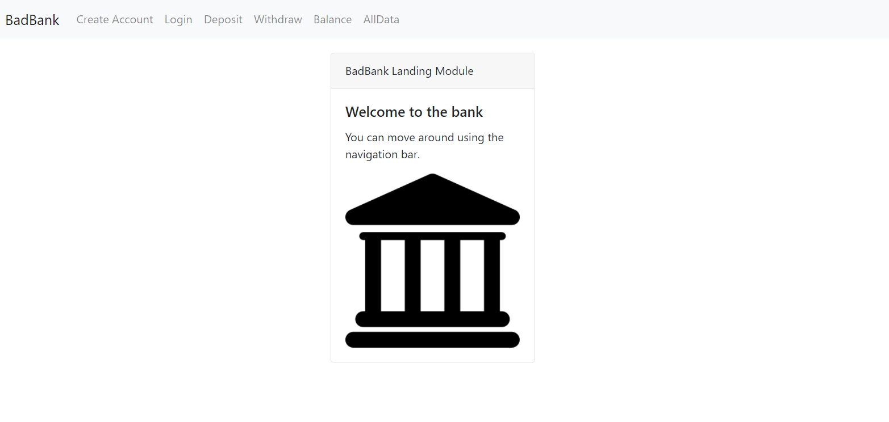

# Bad Bank V2
## With backend and DB

## Description
### A demonstration of an interactive and functional "banking" site with frontend routing to backend and database interactions.

## Installation
Run `git clone https://github.com/maxohsawa/badbankv2.git`
Run `npm install` on main directory
Run `docker run -p 27017:27017 --name badbank -d mongo`
Open the 'public' directory and run `http-server -c-1`
Direct your browser to the IP and port given by http-server

## Screenshots

## Technology Used
- React
- Bootstrap
- Node
- Express
- Docker
- MongoDB

## Features
Site allows for the creation of new accounts, login, deposit, withdrawal, view balance, and view all data.
Would like to add authentication and authorization in a future release.

## License
Copyright 2021 Max Ohsawa

Permission is hereby granted, free of charge, to any person obtaining a copy of this software and associated documentation files (the "Software"), to deal in the Software without restriction, including without limitation the rights to use, copy, modify, merge, publish, distribute, sublicense, and/or sell copies of the Software, and to permit persons to whom the Software is furnished to do so, subject to the following conditions:

The above copyright notice and this permission notice shall be included in all copies or substantial portions of the Software.

THE SOFTWARE IS PROVIDED "AS IS", WITHOUT WARRANTY OF ANY KIND, EXPRESS OR IMPLIED, INCLUDING BUT NOT LIMITED TO THE WARRANTIES OF MERCHANTABILITY, FITNESS FOR A PARTICULAR PURPOSE AND NONINFRINGEMENT. IN NO EVENT SHALL THE AUTHORS OR COPYRIGHT HOLDERS BE LIABLE FOR ANY CLAIM, DAMAGES OR OTHER LIABILITY, WHETHER IN AN ACTION OF CONTRACT, TORT OR OTHERWISE, ARISING FROM, OUT OF OR IN CONNECTION WITH THE SOFTWARE OR THE USE OR OTHER DEALINGS IN THE SOFTWARE.